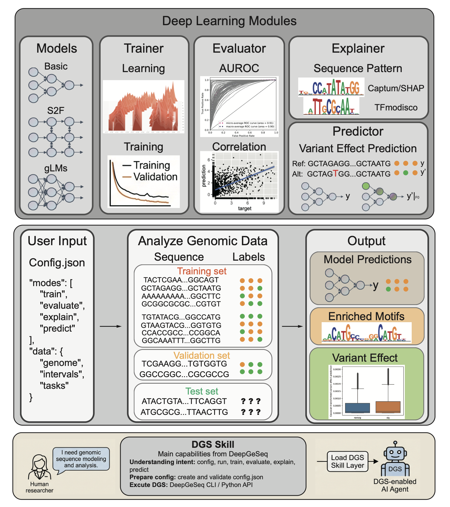

# DeepGeSeq

DeepGeSeq (DGS) is a PyTorch toolkit for building reproducible genomic sequence
workflows. It connects file-native genomic data loading with model training,
evaluation, interpretation, variant-effect prediction, profile modeling, and
in silico sequence design.

<div align="center">
  
  <p><strong>End-to-end deep learning for genomic sequence modeling and analysis</strong></p>
  <p>
    <a href="https://github.com/JiaqiLi1024/DeepGeSeq"></a>
    
    
    <a href="LICENSE"></a>
  </p>
  <p>
    <a href="#installation">Installation</a> |
    <a href="#quick-start">Quick start</a> |
    <a href="#tutorials">Tutorials</a> |
    <a href="docs/source/index.rst">Documentation</a> |
    <a href="#citation">Citation</a>
  </p>
</div>

## Why DGS?

- **File-native genomics:** work directly with FASTA, BED, BigWig, and VCF files.
- **End-to-end workflows:** use the Python API or a configuration-driven CLI for
  training, evaluation, explanation, and prediction.
- **Multiple model families:** start with lightweight CNNs, reproduce published
  architectures, train profile models, or connect external genome language models.
- **Interpretability:** calculate DeepLIFT/SHAP-style or Captum attributions and
  continue into motif-discovery workflows.
- **Reproducibility:** use validated configuration schemas, checkpoint handling,
  deterministic runtime controls, focused tests, and executable notebooks.

| Workflow | Inputs | Main outputs |
|---|---|---|
| Scalar classification/regression | FASTA + BED/BigWig targets | Predictions, checkpoints, task metrics |
| Profile/count modeling | FASTA + interval BED + BigWig profiles | Base-resolution profiles and counts |
| Model interpretation | Model + sequences | Attribution arrays and motif reports |
| Variant-effect prediction | Model + FASTA + VCF | Reference/alternate effect scores |
| Sequence design | Model + seed sequence | Model-optimized candidate sequences |

## Installation

### Requirements

- Python >= 3.7
- PyTorch >= 1.10.1 with CPU or CUDA support

PyTorch 2.x is recommended for new environments. The current optimization pass
was validated locally with Python 3.10.20 and PyTorch 2.11.0 on macOS arm64 CPU.

### Install from source

```bash
git clone https://github.com/JiaqiLi1024/DeepGeSeq.git
cd DeepGeSeq
python -m pip install -e .
```

### Optional features

| Extra | Install command | Adds |
|---|---|---|
| Explain | `python -m pip install -e ".[explain]"` | Captum and tangermeme |
| Genome language models | `python -m pip install -e ".[llm]"` | Transformers and einops |
| Hyperparameter tuning | `python -m pip install -e ".[tune]"` | Ray Tune |
| Notebooks | `python -m pip install -e ".[notebook]"` | Notebook validation/execution tools |
| Development | `python -m pip install -e ".[dev]"` | Pytest |
| Everything | `python -m pip install -e ".[all]"` | All optional Python dependencies |

Motif report generation additionally requires the `modisco` command-line tool
to be available in `PATH`; it is not installed by the Python extras.

## Quick Start

### Command line

Generate a documented configuration, edit the input paths, and run the selected
workflow:

```bash
dgs config --example minimal --output config.json
dgs --gpu -1 --seed 42 run --config config.json
```

Use `--gpu -1` for CPU or replace it with a CUDA device index. Individual modes
can be run independently:

```bash
dgs train --config config.json
dgs evaluate --config config.json
dgs explain --config config.json
dgs predict --config config.json
```

Global flags such as `--gpu`, `--seed`, `--verbose`, and `--no-benchmark` must
appear before the subcommand.

### Python API

The high-level loader API validates common file, coordinate, chromosome, strand,
split, and target-task problems before training begins:

```python
import torch

from DGS.Data import build_supervised_dataloaders
from DGS.DL.Trainer import Trainer
from DGS.Model import CNN


tasks = [{
    "task_name": "binding",
    "file_path": "peaks.bed",
    "file_type": "bed",
    "task_type": "binary",
}]

train_loader, val_loader, test_loader = build_supervised_dataloaders(
    fasta_path="genome.fa",
    intervals_path="regions.bed",
    target_tasks=tasks,
    split="chromosome",
    val_chroms=["chr7"],
    test_chroms=["chr8"],
    batch_size=64,
    mode="streaming",
    num_workers=0,
)

model = CNN(output_size=1, tasktype="classification")
trainer = Trainer(
    model=model,
    criterion=torch.nn.BCELoss(),
    optimizer=torch.optim.Adam(model.parameters(), lr=1e-3),
    device=torch.device("cuda" if torch.cuda.is_available() else "cpu"),
    checkpoint_dir="checkpoints",
    use_tensorboard=False,
)
trainer.train(train_loader, val_loader, epochs=10)
_, _, predictions, targets = trainer.validate(test_loader, return_predictions=True)
```

For a self-contained CPU example that creates its own small FASTA and BED
fixtures, see [`DGS/tests/test_core_workflow_smoke.py`](DGS/tests/test_core_workflow_smoke.py).

## Core Workflows

### Data loading

| Builder | Purpose | Batch convention |
|---|---|---|
| `build_sequence_dataloader` | Sequence-only FASTA/BED loading | `(batch, length, 4)` |
| `build_supervised_dataloader` | Scalar labels from BED/BigWig targets | Sequences + `(batch, tasks)` |
| `build_supervised_dataloaders` | Train/validation/test splitting | Three supervised loaders |
| `build_profile_dataloader` | Base-resolution BigWig profiles | Sequences + `(batch, tracks, length)` |
| `build_profile_dataloaders` | Split profile/count datasets | Three profile loaders |

`mode="streaming"` reads sequence windows from FASTA on demand and is the
recommended default for large datasets. Use `mode="cached"` when a small dataset
benefits from eager sequence extraction.

### Models

DGS exposes model support metadata through `DGS.Model.get_model_zoo()`.

| Family | Models/adapters | Scope |
|---|---|---|
| Lightweight scalar | `CNN`, `CAN` | Classification and regression |
| Published scalar | `DeepSEA`, `Beluga`, `DanQ`, `Basset`, `scBasset` | Multi-task sequence prediction |
| Profile/count | `BPNet`, `ChromBPNet`, `Enformer`, `Borzoi` | Base-resolution regulatory profiles |
| External profile | `KerasProfileAdapter` | Optional TensorFlow `.h5` inference bridge |
| Genome language models | `DNABERTAdapter`, `DNABERT2Adapter`, `NucleotideTransformerAdapter`, `GPNAdapter`, `Evo2Adapter` | External embeddings or logits |

The native PyTorch ChromBPNet- and Borzoi-style modules target DGS workflow and
interface compatibility. Official pretrained `.h5` checkpoints still require
their source TensorFlow environments and can be connected through
`KerasProfileAdapter`.

Genome language model adapters keep heavyweight runtimes and checkpoints
optional. DGS provides the adapter/factory interface; model files remain
external and should be cited according to their source project.

### Interpretation

```python
from DGS.DL.Explain import calculate_attributions_on_ds, save_attribution_artifacts

sequences, attributions = calculate_attributions_on_ds(
    model,
    test_loader.dataset,
    target=0,
    device="cpu",
    batch_size=32,
    method="integrated_gradients",
    n_steps=16,
)

save_attribution_artifacts(
    "outputs/attributions.npz",
    sequences,
    attributions,
    method="integrated_gradients",
    target=0,
)
```

Attribution artifacts use channel-first arrays with shape
`(samples, 4, sequence_length)` and can be written as `.npz` or `.h5`.

### Variant effects

```python
from DGS.DL.Predict import vep_centred_from_files

variant_predictions = vep_centred_from_files(
    model,
    genome_filename="genome.fa",
    bcf_filename="variants.vcf",
    target_len=1000,
    metric_func="diff",
    mean_by_tasks=True,
    batch_size=64,
    return_df=True,
)
```

This path supports simple DNA REF/ALT alleles (`A/C/G/T/N`). Confirm that the
FASTA and VCF use the same genome build and chromosome naming scheme.

### Sequence design

```python
from DGS.DL.Design import gradient_ascent_sequence_design, greedy_ism_sequence_design

gradient_result = gradient_ascent_sequence_design(
    model,
    initial_sequence="N" * 200,
    output_index=0,
    steps=100,
    lr=0.1,
)
greedy_result = greedy_ism_sequence_design(
    model,
    initial_sequence=gradient_result.sequence,
    output_index=0,
    max_steps=20,
)
```

Designed sequences are model-guided hypotheses, not experimentally validated
regulatory elements.

## Tutorials

Start with the focused usage notebooks:

| Notebook | Covers |
|---|---|
| [`0_DGS_data.ipynb`](Tutorials/0_DGS_usage_models/0_DGS_data.ipynb) | Sequence, supervised, and profile data interfaces |
| [`1_DGS_models.ipynb`](Tutorials/0_DGS_usage_models/1_DGS_models.ipynb) | Scalar models and the model zoo |
| [`2_DGS_profile_models.ipynb`](Tutorials/0_DGS_usage_models/2_DGS_profile_models.ipynb) | BPNet-style profile/count workflows |
| [`3_DGS_gLMs.ipynb`](Tutorials/0_DGS_usage_models/3_DGS_gLMs.ipynb) | Genome language model adapters and pooling |
| [`4_DGS_explain.ipynb`](Tutorials/0_DGS_usage_models/4_DGS_explain.ipynb) | Attribution and motif interpretation |

Additional walkthroughs are organized by use case:

- [`0_DGS_usage_example`](Tutorials/0_DGS_usage_example): minimal API and skill examples
- [`1_DGS_workflow_on_synthetic_dataset`](Tutorials/1_DGS_workflow_on_synthetic_dataset): complete synthetic-data workflow
- [`2_DGS_reproduce_DeepSEA`](Tutorials/2_DGS_reproduce_DeepSEA): DeepSEA reproduction and sequence analysis
- [`3_DGS_seqAnalysis_sciATAC`](Tutorials/3_DGS_seqAnalysis_sciATAC): sciATAC model training and interpretation
- [`4_DGS_single_cell_data`](Tutorials/4_DGS_single_cell_data): single-cell accessibility modeling
- [`5_DGS_MPRA`](Tutorials/5_DGS_MPRA): MPRA prediction, interpretation, and design

Notebook structure checks run by default. Full execution is opt-in because some
case studies require the original datasets and external tools:

```bash
python -m pip install -e ".[notebook]"
pytest -q DGS/tests/tutorials/test_notebook_static.py
DGS_RUN_TUTORIAL_NOTEBOOKS=1 pytest -q DGS/tests/tutorials/test_notebook_static.py
```

## Configuration

Create a configuration with `dgs config --example minimal` rather than copying a
stale template. Important conventions are:

- Optimizer options belong under `train.optimizer.params`.
- Loss options belong under `train.criterion.params`.
- `data.loader_mode` accepts `"streaming"` or `"cached"`.
- Evaluate-only runs can load `evaluate.checkpoint_path` without optimizer state.
- `train.use_amp` is opt-in and is enabled only on CUDA.
- `predict.batch_size > 1` enables batched VCF inference.

Configuration can also be checked from Python:

```python
from DGS.Config import get_config_schema_reference, validate_config

schema = get_config_schema_reference()
validate_config(config, check_files=True)
```

Legacy flat optimizer/loss fields are normalized for compatibility, but new
configurations should use explicit nested `params` blocks.

## Inputs and Outputs

Typical inputs:

- Indexed genome FASTA
- BED intervals
- BED or BigWig targets
- VCF variants

Common CLI outputs:

- `checkpoints/best_model.pt` and `checkpoints/final_model.pt`
- `<output_dir>/metrics.csv`
- `<output_dir>/variant_predictions.csv`
- `<explain.output_dir>/` attribution and motif outputs
- `<output_dir>/<output_dir>_<timestamp>.log`

## Documentation and Development

The Sphinx guide contains the detailed public API, tensor conventions,
configuration schema, checkpoint semantics, model support boundaries, and
release checklist:

- [Library guide](docs/source/library_guide.rst)
- [API reference](docs/source/api/index.rst)

Build the HTML documentation locally:

```bash
python DGS/tests/docstring_audit.py
python -m pip install -r docs/requirements.txt
sphinx-build -b html docs/source docs/build/html
```

Run the test suite after installing the development extra:

```bash
python -m pip install -e ".[dev]"
pytest -q
```

Focused checks for the main workflow:

```bash
pytest -q DGS/tests/data/test_loader.py
pytest -q DGS/tests/dl/test_trainer_failure_handling.py
pytest -q DGS/tests/test_core_workflow_smoke.py
```

Issues and pull requests are welcome at the
[GitHub repository](https://github.com/JiaqiLi1024/DeepGeSeq/issues).

## Troubleshooting

- **Missing Captum or tangermeme:** install `.[explain]`.
- **Missing `modisco`:** install TF-MoDISco-lite and ensure the executable is in `PATH`.
- **FASTA index errors:** run `samtools faidx genome.fa` or `pysam.faidx("genome.fa")`.
- **Reference allele mismatch:** verify FASTA/VCF build, chromosome names, and REF alleles.
- **Unknown model type:** choose an exported name from `DGS.Model.get_model_zoo()`.
- **Evaluate-only checkpoint errors:** set `evaluate.checkpoint_path` and keep the
  data/model configuration required to rebuild the workflow.

## Citation

If you use DeepGeSeq in your research, please cite:

```bibtex
@article{li2024deepgeseq,
  title  = {DeepGeSeq: Deep learning library for genomic sequence modeling and analysis},
  author = {Li, Jiaqi},
  year   = {2024}
}
```

## License

DeepGeSeq is released under the [BSD 3-Clause License](LICENSE).

## Contact

- Jiaqi Li: [jiaqili@zju.edu.cn](mailto:jiaqili@zju.edu.cn)
- Issues: [github.com/JiaqiLi1024/DeepGeSeq/issues](https://github.com/JiaqiLi1024/DeepGeSeq/issues)
